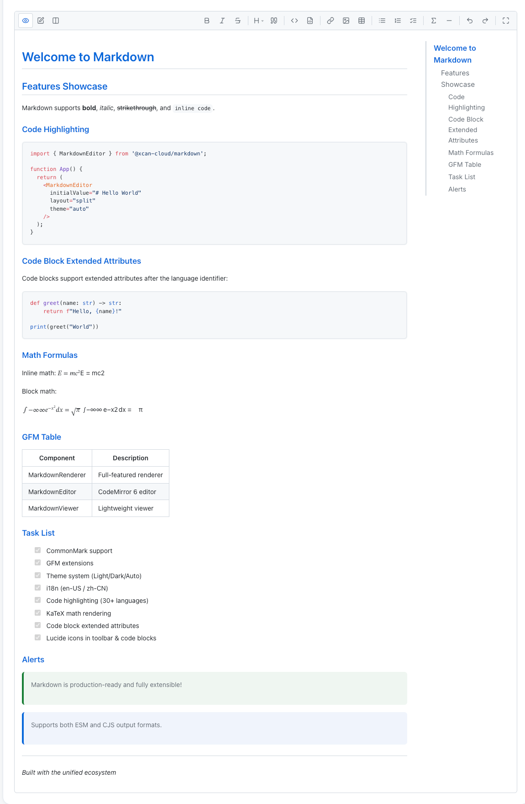

<div align="center">

# Markdown

[](https://www.npmjs.com/package/@xcan-cloud/markdown)
[](./LICENSE)
[](https://react.dev/)

面向 React 的生产级 Markdown **渲染**与**编辑**方案 —— 集成 CommonMark / GFM、数学公式、Mermaid、Shiki 高亮、CodeMirror 编辑器、主题与国际化。

[English](./README.md) · **简体中文** · [仓库](https://github.com/xcancloud/Markdown) · [npm](https://www.npmjs.com/package/@xcan-cloud/markdown)

<br />



<br />

</div>

---

## 目录

- [特性](#特性)
- [快速开始](#快速开始)
- [API 参考](#api-参考)
- [ProcessorOptions](#processoroptions)
- [导出工具](#导出工具)
- [Hooks](#hooks)
- [组件架构](#组件架构)
- [子项目](#子项目)
- [原生 HTML 支持](#原生-html-支持)
- [剪贴板图片上传](#剪贴板图片上传)
- [自定义](#自定义)
- [技术栈](#技术栈)
- [浏览器支持](#浏览器支持)
- [开发](#开发)
- [贡献](#贡献)
- [许可证](#许可证)

## 特性

- **CommonMark & GFM** — 表格、任务列表、删除线、脚注、自动链接等
- **语法高亮** — 通过 [Shiki](https://shiki.style/) 支持 30+ 语言（接近 VS Code 主题质量）
- **数学公式** — 行内与块级 KaTeX（`$...$`、`$$...$$`）
- **Mermaid** — 流程图、时序图、甘特图、类图等（客户端懒加载渲染）
- **SVG 预览** — 围栏代码块 ` ```svg ` 或内容为 SVG 的 ` ```xml ` 经净化后**内联预览**（非流式时支持复制 / 下载）
- **富文本编辑器** — CodeMirror 6、工具栏、分栏 / 标签布局、图片粘贴与拖拽、自动保存、快捷键
- **代码块体验** — 复制、下载（按语言扩展名；可通过 `file:` 或注释元信息指定文件名）、HTML 沙箱预览
- **GFM 提示与容器** — `> [!NOTE]` / `> [!WARNING]` 与 `:::tip` / `:::warning` 等指令
- **目录侧栏** — 自动生成大纲并跟踪当前标题（`MarkdownRenderer`）
- **Front Matter** — 通过 remark-frontmatter 解析 YAML / TOML 元数据
- **Emoji** — `:smile:` 简写（remark-emoji）
- **安全** — rehype-sanitize 配置、URL 处理、面向 XSS 的默认策略
- **无障碍** — rehype a11y 辅助、面向 ARIA 的输出
- **流式渲染** — `streaming` 属性适配 SSE / 分块内容（跳过防抖、光标提示）
- **主题** — 浅色 / 深色 / 跟随系统亮暗模式 + `ThemeVariant` 皮肤体系（Default / Angus / GitHub）；全面采用 CSS 变量
- **国际化** — 内置 `en-US`、`zh-CN`
- **双构建** — ESM + CJS、TypeScript 声明、可按需 tree-shaking 的入口

## 快速开始

### 安装

```bash
npm install @xcan-cloud/markdown
```

Peer dependencies（对等依赖）：

```bash
npm install react react-dom
```

在应用中引入样式（仅需一次）：

```tsx
import '@xcan-cloud/markdown/styles';
```

> 这一行已同时包含渲染器与编辑器所需的全部基础样式。
> 主题预设（GitHub、Angus）需单独引入，详见[自定义](#自定义)。

### 基础渲染

```tsx
import { MarkdownRenderer } from '@xcan-cloud/markdown';
import '@xcan-cloud/markdown/styles';

function App() {
  return <MarkdownRenderer source="# Hello\n\nThis is **Markdown**." />;
}
```

### 编辑器（分栏视图）

```tsx
import { MarkdownEditor } from '@xcan-cloud/markdown';
import '@xcan-cloud/markdown/styles';

function App() {
  return (
    <MarkdownEditor
      initialValue="# Start editing…"
      layout="split"
      onChange={(value) => console.log(value)}
    />
  );
}
```

### 主题与语言 Provider

```tsx
import {
  MarkdownProvider,
  MarkdownEditor,
  ThemeSwitcher,
  LocaleSwitcher,
} from '@xcan-cloud/markdown';
import '@xcan-cloud/markdown/styles';

function App() {
  return (
    // defaultVariant="angus" — Angus 皮肤 CSS 已内置在 @xcan-cloud/markdown/styles 中，无需额外引入
    <MarkdownProvider defaultTheme="auto" defaultVariant="angus" defaultLocale="zh-CN">
      <div style={{ display: 'flex', gap: 8, marginBottom: 16 }}>
        <ThemeSwitcher />   {/* 切换 light / dark / auto */}
        <LocaleSwitcher />
      </div>
      <MarkdownEditor initialValue="# 你好" layout="split" />
    </MarkdownProvider>
  );
}
```

### SSR 友好的 Viewer（无 CodeMirror 依赖）

```tsx
import { MarkdownViewer } from '@xcan-cloud/markdown';
import '@xcan-cloud/markdown/styles';

function Page({ markdown }: { markdown: string }) {
  return <MarkdownViewer source={markdown} theme="light" />;
}
```

## API 参考

### `<MarkdownRenderer />`

全功能渲染器：目录侧栏、Mermaid / SVG 后处理、代码块操作、流式模式。

| Prop | Type | Default | 说明 |
| --- | --- | --- | --- |
| `source` | `string` | — | Markdown 源文本 |
| `options` | `ProcessorOptions` | — | unified 流水线选项 |
| `className` | `string` | `''` | 根节点 class |
| `theme` | `'light' \| 'dark' \| 'auto'` | 来自上下文 / `'auto'` | 配色模式 |
| `showToc` | `boolean` | `true` | 是否显示目录侧栏 |
| `tocPosition` | `'left' \| 'right'` | `'right'` | 目录位置 |
| `debounceMs` | `number` | `150` | 渲染防抖（`streaming` 为 true 时不使用） |
| `onRendered` | `(info: { html: string; toc: TocItem[] }) => void` | — | 渲染成功回调 |
| `onLinkClick` | `(href: string, event: MouseEvent) => void` | — | 链接点击拦截 |
| `onImageClick` | `(src: string, alt: string, event: MouseEvent) => void` | — | 图片点击 |
| `components` | `Partial<Record<string, ComponentType<any>>>` | — | 自定义 HTML 标签映射 |
| `streaming` | `boolean` | `false` | 是否处于流式接收 |
| `onStreamEnd` | `() => void` | — | `streaming` 从 `true` 变为 `false` 时触发 |
| `height` | `string` | — | 渲染容器固定高度 |
| `minHeight` | `string` | — | 渲染容器最小高度 |
| `maxHeight` | `string` | — | 渲染容器最大高度 |

### `<MarkdownEditor />`

继承渲染器的大部分属性，**不再使用** `source`，改为编辑器的 `initialValue` / `value` / `onChange`。

| Prop | Type | Default | 说明 |
| --- | --- | --- | --- |
| `initialValue` | `string` | `''` | 初始 Markdown |
| `value` | `string` | — | 受控内容 |
| `onChange` | `(value: string) => void` | — | 内容变化 |
| `layout` | `LayoutMode` | `'split'` | `split` \| `tabs` \| `editor-only` \| `preview-only` |
| `layoutModes` | `LayoutMode[]` | `['split', 'tabs', 'editor-only', 'preview-only']` | 控制布局按钮显示范围，以及 `layout` 工具栏动作的循环顺序 |
| `minHeight` / `maxHeight` | `string` | — | 编辑区域高度 |
| `toolbar` | `ToolbarConfig` | 默认集合 | `false` 隐藏，或传入按钮项数组 |
| `readOnly` | `boolean` | `false` | 只读 |
| `onImageUpload` | `(file: File) => Promise<string>` | — | 粘贴/拖拽图片时返回可访问 URL，详见 [剪贴板图片上传](#剪贴板图片上传) |
| `onImageUploadSettled` | `(r: { success: true; url: string; file: File } \| { success: false; error: unknown; file: File }) => void` | — | 每次上传完成或失败时触发（用于 toast / 日志） |
| `mixedPastePolicy` | `'image-first' \| 'text-first' \| 'image-and-text'` | `'image-first'` | 剪贴板同时包含图片与文本时的策略 |
| `onPaste` | `(payload: ClipboardPayload, event: ClipboardEvent) => boolean \| void` | — | 自定义粘贴钩子；返回 `true` 表示自行处理，跳过默认逻辑 |
| `onAutoSave` | `(value: string) => void` | — | 定时自动保存回调 |
| `autoSaveInterval` | `number` | `30000` | 自动保存间隔（毫秒） |
| `extensions` | `Extension[]` | `[]` | 额外 CodeMirror 扩展 |
| `shortcuts` | `ShortcutMap` | — | 自定义快捷键 |
| `maxLength` | `number` | — | 最大字数 + 底部计数 UI |
| `placeholder` | `string` | i18n 默认文本 | 编辑器占位提示文本 |

除 `source` 外，**`MarkdownRenderer`** 的 props 同样作用于预览区（如 `options`、`theme`、`showToc`）。

### `<MarkdownViewer />`

基于 `useMarkdown` 的轻量查看组件（**无** CodeMirror 依赖）。

| Prop | Type | Default | 说明 |
| --- | --- | --- | --- |
| `source` | `string` | — | Markdown 源 |
| `options` | `ProcessorOptions` | — | 流水线选项 |
| `className` | `string` | `''` | 根节点 class |
| `theme` | `'light' \| 'dark' \| 'auto'` | 来自上下文 | 主题 |
| `onRendered` | `(info: { html: string; toc: TocItem[] }) => void` | — | 渲染完成回调 |
| `height` | `string` | — | 查看容器固定高度 |
| `minHeight` | `string` | — | 查看容器最小高度 |
| `maxHeight` | `string` | — | 查看容器最大高度 |

### `<MarkdownProvider />`

| Prop | Type | Default | 说明 |
| --- | --- | --- | --- |
| `children` | `ReactNode` | — | 子树 |
| `defaultTheme` | `'light' \| 'dark' \| 'auto'` | `'auto'` | 亮暗模式 |
| `defaultVariant` | `'default' \| 'angus' \| 'github'` | `'angus'` | 视觉皮肤 |
| `defaultLocale` | `'en-US' \| 'zh-CN'` | `'en-US'` | 初始语言 |

### `<ThemeSwitcher />` / `<LocaleSwitcher />`

可选 UI；也可通过 `useTheme()`、`useLocale()` 读写主题与语言。

### TypeScript（核心 Props）

```tsx
interface MarkdownRendererProps {
  source: string;
  options?: ProcessorOptions;
  className?: string;
  theme?: 'light' | 'dark' | 'auto';
  showToc?: boolean;
  tocPosition?: 'left' | 'right';
  debounceMs?: number;
  onRendered?: (info: { html: string; toc: TocItem[] }) => void;
  onLinkClick?: (href: string, event: React.MouseEvent) => void;
  onImageClick?: (src: string, alt: string, event: React.MouseEvent) => void;
  components?: Partial<Record<string, React.ComponentType<any>>>;
  streaming?: boolean;
  onStreamEnd?: () => void;
  height?: string;
  minHeight?: string;
  maxHeight?: string;
}
```

## ProcessorOptions

| Option | Type | Default | 说明 |
| --- | --- | --- | --- |
| `gfm` | `boolean` | `true` | GitHub 风格 Markdown |
| `math` | `boolean` | `true` | KaTeX |
| `mermaid` | `boolean` | `true` | Mermaid 代码块 |
| `frontmatter` | `boolean` | `true` | YAML/TOML 前言 |
| `emoji` | `boolean` | `true` | Emoji 简写 |
| `toc` | `boolean` | `false` | `[[toc]]` / `[toc]` 占位替换 |
| `sanitize` | `boolean` | `true` | HTML 净化 |
| `sanitizeSchema` | `Schema` | 内置 | 自定义 rehype-sanitize schema |
| `codeTheme` | `string` | `'github-dark'` | Shiki 主题名 |
| `highlight` | `boolean` | `true` | Shiki 高亮（异步流水线） |
| `allowHtml` | `boolean` | `true` | 是否允许原始 HTML 路径 |
| `remarkPlugins` | `Plugin[]` | `[]` | 额外 remark 插件 |
| `rehypePlugins` | `Plugin[]` | `[]` | 额外 rehype 插件 |

## 导出工具

| 导出 | 说明 |
| --- | --- |
| `createProcessor`, `renderMarkdown`, `renderMarkdownSync`, `parseToAst` | 核心 unified 流水线 |
| `ProcessorOptions` | 流水线配置类型 |
| `rehypeHighlightCode` | Shiki 高亮 rehype 插件 |
| `renderMermaidDiagram`, `initMermaid` | 客户端 Mermaid 辅助 |
| `extractToc`, `remarkToc`, `TocItem` | 目录提取 / remark 插件 |
| `remarkAlert`, `remarkContainer`, `remarkCodeMeta` | 提示、容器、代码元信息 remark 插件 |
| `parseCodeMeta`, `extractCodeBlocks`, `CodeBlockMeta` | 围栏属性解析 |
| `sanitizeUrl`, `processExternalLinks`, `escapeHtml` | 安全相关工具 |
| `rehypeA11y` | 无障碍 rehype 插件 |
| `MarkdownWorkerRenderer`, `RenderCache`, `splitHtmlBlocks` | Worker / 分块缓存 |
| `copyToClipboard` | 剪贴板 |
| `performImageUpload`、`createImageUploadLifecycle`、`encodeMarkdownUrl`、`sanitizeAltText`、`isImageFile`、`collectImageFiles`、`generateUploadId` | 剪贴板 / 拖拽图片上传工具（详见 [剪贴板图片上传](#剪贴板图片上传)） |
| `slug`, `resetSlugger` | 标题 slug |
| `setLocale`, `getLocale`, `t`, `getMessages` | 国际化 API |
| `ThemeVariant`, `resolveThemeClass` | 皮肤类型与 CSS 类名解析函数 |

## Hooks

| Hook | 说明 |
| --- | --- |
| `useMarkdown(source, options?)` | 返回 `{ html, toc, isLoading, error, refresh }` |
| `useDebouncedValue(value, delay)` | 防抖值 |
| `useScrollSync(editorRef, previewRef)` | 编辑区与预览区双向滚动同步 |

## 组件架构

```
┌─────────────────────────────────────────────────────────────┐
│                    MarkdownProvider                            │
│              (theme / locale context)                        │
└───────────────────────────┬─────────────────────────────────┘
                            │
        ┌───────────────────┼───────────────────┐
        ▼                   ▼                   ▼
 ┌──────────────┐  ┌──────────────┐  ┌──────────────────┐
 │ MarkdownEditor│  │MarkdownRenderer│ │ MarkdownViewer  │
 │ ┌──────────┐ │  │ • unified +    │  │ • useMarkdown    │
 │ │ CodeMirror│ │  │   Shiki/KaTeX  │  │ • no CM dep      │
 │ │ + Toolbar │ │  │ • TOC sidebar  │  └──────────────────┘
 │ └──────────┘ │  │ • Mermaid/SVG  │
 │ ┌──────────┐ │  │ • code actions │
 │ │ Preview  │◄┼──┤   (copy/…)     │
 │ │ (Renderer)│ │  └────────────────┘
 │ └──────────┘ │
 └──────────────┘
```

## 子项目

| 路径 | 说明 |
| --- | --- |
| [`website/`](./website/) | Vite 本地开发与演示 |
| [`src/styles/`](./src/styles/) | 基础 `markdown-renderer.css` 与主题预设（`themes/github.css`、`themes/angus.css`） |

## 原生 HTML 支持

默认 `allowHtml: true`，Markdown 中的原生 HTML 会端到端透传（解析 → 净化 → 渲染）。
内置净化 schema 已在所有元素上允许 `class`、`style`、`id`、`data-*`
属性，因此带尺寸约束的 `` 可以安全通过：

```markdown

```

同时仍保留以下安全约束：

- 净化阶段会移除 `<script>` / `<iframe>` / `<object>` / `<embed>`；
- `href` / `src` 中的 `javascript:` / `vbscript:` 协议会被丢弃；
- `data:` URL 仅允许用于图片；
- 未列入白名单的标签默认被剥离。

如需进一步收紧或放宽策略，可通过 `ProcessorOptions.sanitizeSchema`
传入自定义 schema。

## 剪贴板图片上传

`MarkdownEditor` 支持剪贴板粘贴与拖拽插入图片。只需提供返回最终 URL
的上传回调，编辑器会自动处理插入唯一占位符、成功后替换为
``、失败时替换为 HTML 注释等全部细节。

```tsx
import { MarkdownEditor } from '@xcan-cloud/markdown';

async function uploadToCdn(file: File): Promise<string> {
  const fd = new FormData();
  fd.append('file', file);
  const res = await fetch('/api/upload', { method: 'POST', body: fd });
  if (!res.ok) throw new Error(`上传失败：${res.status}`);
  const { url } = await res.json();
  return url;
}

<MarkdownEditor
  onImageUpload={uploadToCdn}
  onImageUploadSettled={(r) => {
    if (r.success) toast.success(`已上传 ${r.file.name}`);
    else toast.error(`上传失败：${String(r.error)}`);
  }}
/>
```

行为保证：

- **占位符唯一。** 每次上传生成随机 id，保证并发粘贴互不覆盖。
- **失败可见。** 上传 Promise 被 reject 时，占位符会被替换为
  `<!-- 上传失败: <原因> -->`，不会污染渲染结果但在源码中保留痕迹。
- **多文件拖拽。** 同时拖入多张图片时会在落点处并行上传。
- **国际化。** 占位符文本使用当前语言包（`editor.uploading`、
  `editor.uploadFailed`）。
- **URL 安全。** URL 中的空白字符与 `(` `)` 会被百分号编码，
  返回的 CDN URL 即使包含空格或圆括号也不会破坏 Markdown 语法。

### 文本 / 文件分流

编辑器会区分 **文本粘贴** 与 **文件粘贴**，默认不会拦截纯文本输入：

| 剪贴板内容 | 默认行为 |
| --- | --- |
| 纯文本 / HTML | 走浏览器默认粘贴 |
| 仅图片 | 上传图片并插入 `` |
| 图片 + 文本（如 Windows 截图） | 由 `mixedPastePolicy` 控制 |
| 仅非图片文件（pdf / zip 等） | 走浏览器默认（不会被上传） |

```tsx
<MarkdownEditor
  onImageUpload={uploadToCdn}
  mixedPastePolicy="image-and-text"   // 既上传截图又保留文字说明
  onPaste={(payload) => {
    if (payload.otherFiles.some(f => f.type === 'application/pdf')) {
      toast.warn('已忽略 PDF 粘贴');
      return true; // 自行处理，跳过默认流程
    }
  }}
/>
```

驱动上述分流的 `classifyClipboard(transfer)` 工具（返回
`{ images, otherFiles, text, html, uriList, hasImages, hasText, ... }`）
也会从包根路径导出，与 `performImageUpload`、
`createImageUploadLifecycle`、`encodeMarkdownUrl`、`isImageFile`、
`collectImageFiles` 一同供自定义封装使用。

## 自定义

### 主题

主题系统由两个正交维度组成：

- **`defaultTheme`** — 亮暗模式：`'light'`、`'dark'`、`'auto'`（跟随 `prefers-color-scheme`）
- **`defaultVariant`** — 视觉皮肤：`'default'`、`'angus'`、`'github'`

两者组合后映射为根容器上的一个 CSS 类：

| 皮肤 \ 模式 | `light` | `dark` |
| --- | --- | --- |
| `default` | `markdown-theme-light` | `markdown-theme-dark` |
| `angus` | `markdown-theme-angus` | `markdown-theme-angus-dark` |
| `github` | `markdown-theme-github` | `markdown-theme-github-dark` |

#### 默认皮肤（仅切换亮暗）

```tsx
import '@xcan-cloud/markdown/styles';
import { MarkdownProvider, MarkdownRenderer } from '@xcan-cloud/markdown';

function App() {
  return (
    <MarkdownProvider defaultTheme="auto">
      <MarkdownRenderer source="# Hello" />
    </MarkdownProvider>
  );
}
```

#### Angus 皮肤

Angus 皮肤的 CSS **已内置在** `@xcan-cloud/markdown/styles` 中，无需额外引入。

```tsx
import '@xcan-cloud/markdown/styles';
import { MarkdownProvider, MarkdownEditor, ThemeSwitcher } from '@xcan-cloud/markdown';

function App() {
  return (
    // defaultVariant="angus"：浅色 → markdown-theme-angus
    //                          深色 → markdown-theme-angus-dark
    <MarkdownProvider defaultTheme="auto" defaultVariant="angus">
      <ThemeSwitcher />
      <MarkdownEditor initialValue="# 你好" layout="split" />
    </MarkdownProvider>
  );
}
```

#### GitHub 皮肤

GitHub 皮肤需要额外引入 CSS：

```tsx
import '@xcan-cloud/markdown/styles';
import '@xcan-cloud/markdown/themes/github.css';   // ← 需单独引入
import { MarkdownProvider, MarkdownRenderer } from '@xcan-cloud/markdown';

function App() {
  return (
    // defaultVariant="github"：浅色 → markdown-theme-github
    //                           深色 → markdown-theme-github-dark
    <MarkdownProvider defaultTheme="light" defaultVariant="github">
      <MarkdownRenderer source="# Hello" />
    </MarkdownProvider>
  );
}
```

#### 运行时切换皮肤

```tsx
import { useTheme } from '@xcan-cloud/markdown';

function VariantSwitcher() {
  const { variant, setVariant } = useTheme();
  return (
    <select value={variant} onChange={(e) => setVariant(e.target.value as any)}>
      <option value="default">默认</option>
      <option value="angus">Angus</option>
      <option value="github">GitHub</option>
    </select>
  );
}
```

### CSS 变量

在 `.markdown-renderer` 上覆盖 `--md-*` 等变量（详见样式表）。

### i18n

```tsx
<MarkdownProvider defaultLocale="zh-CN">
  <MarkdownEditor initialValue="# 你好" />
</MarkdownProvider>
```

```tsx
import { setLocale, t } from '@xcan-cloud/markdown';

setLocale('zh-CN');
```

### 工具栏

```tsx
<MarkdownEditor toolbar={false} />
<MarkdownEditor toolbar={['bold', 'italic', '|', 'code']} />
```

> 在 `layout="tabs"` 场景下，如果 `toolbar={false}`，组件仍会渲染一个内置的最小切换条（编辑 / 预览），以保证 tabs 模式可操作。

### layout 与 layoutModes

`LayoutMode` 已公开导出，可在业务侧 TypeScript 直接使用：

```tsx
import { MarkdownEditor, type LayoutMode } from '@xcan-cloud/markdown';
```

`layout` 用于控制当前布局：

- `split`：编辑区与预览区并排显示
- `tabs`：一次仅显示一个面板（编辑 / 预览），通过预览动作或内置切换条切换
- `editor-only`：仅显示编辑区
- `preview-only`：仅显示预览区

`layoutModes` 用于控制 **可用布局集合**，以及 `layout` 工具栏动作的 **循环顺序**。

- 默认值：`['split', 'tabs', 'editor-only', 'preview-only']`
- 传入空数组时会回退到默认集合
- 若当前 `layout` 不在 `layoutModes` 中，会自动回退到 `layoutModes[0]`

示例：

```tsx
// 仅保留“编辑整页 / 预览整页”两种布局
<MarkdownEditor
  layout="editor-only"
  layoutModes={['editor-only', 'preview-only']}
/>

// 仅保留 tabs 与 split
<MarkdownEditor
  layout="tabs"
  layoutModes={['tabs', 'split']}
/>
```

### 高度设置

```tsx
// 固定高度
<MarkdownRenderer source={md} height="600px" />
<MarkdownViewer source={md} height="400px" />

// 最小 / 最大高度
<MarkdownRenderer source={md} minHeight="200px" maxHeight="80vh" />

// 编辑器 CodeMirror 区域高度
<MarkdownEditor minHeight="300px" maxHeight="700px" />
```

### 代码块扩展属性

````markdown
```python filename=hello.py
print("hi")
```
````

外部工具可配合 `parseCodeMeta`、`extractCodeBlocks` 使用。

## 技术栈

| 类别 | 技术 |
| --- | --- |
| 框架 | React 18+、TypeScript |
| Markdown | unified、remark、rehype、remark-gfm、remark-math 等 |
| 高亮 | Shiki |
| 图表 | Mermaid（客户端）、KaTeX |
| 编辑器 | CodeMirror 6 |
| 图标 | lucide-react |
| 构建 | Vite、vite-plugin-dts |

## 浏览器支持

支持主流现代浏览器（Chrome、Firefox、Safari、Edge 等最近两个大版本）。`fetch` 流、Web Worker 等能力随浏览器本身支持情况而定。

## 开发

```bash
npm install
npm run dev      # website 演示
npm run build    # 构建库 dist
npm test
npm run lint     # tsc --noEmit
```

## 贡献

1. Fork 本仓库。
2. 新建分支：`git checkout -b feat/your-feature`。
3. 提交清晰的 commit 说明。
4. 推送并发起 Pull Request。

提交前请确保 `npm run lint` 与 `npm run build` 通过。

## 许可证

[MIT](./LICENSE) © Markdown package contributors
